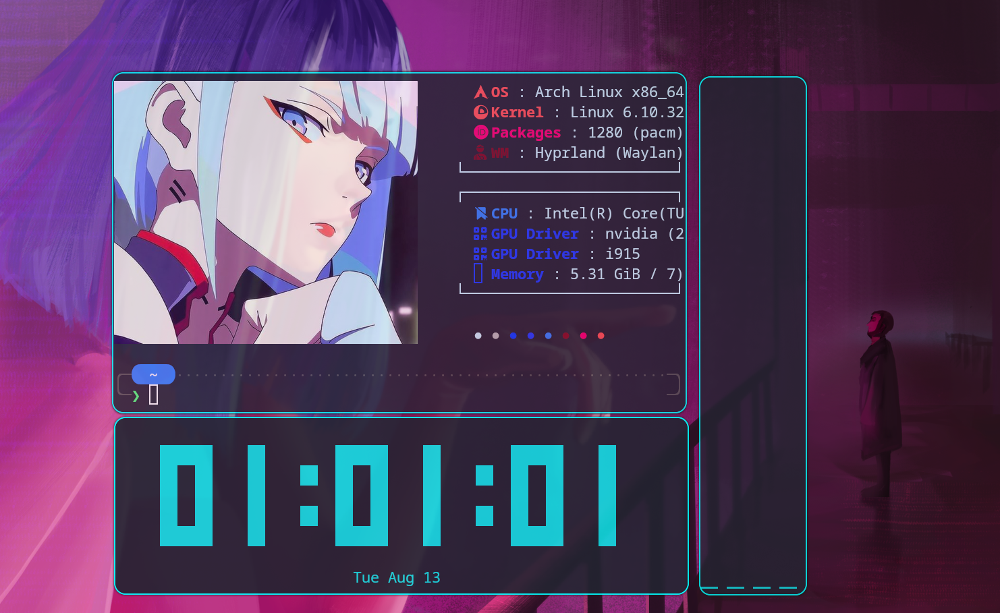
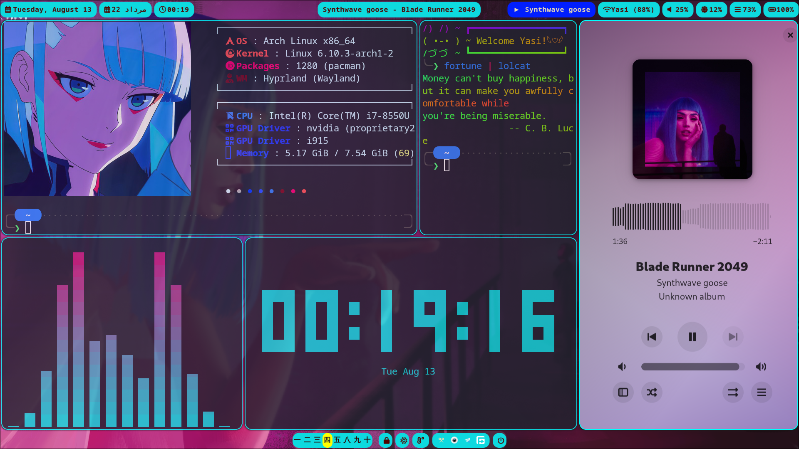
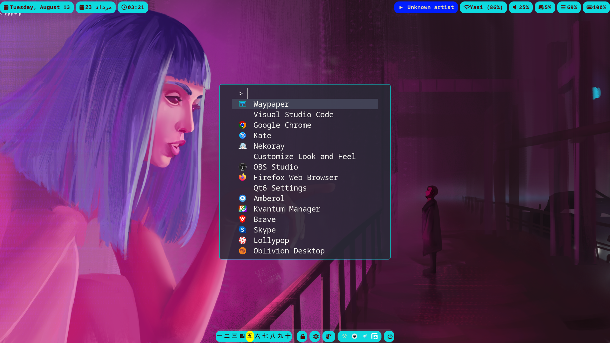
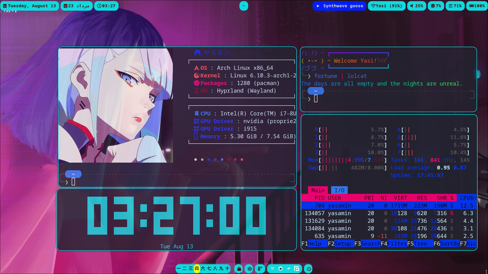
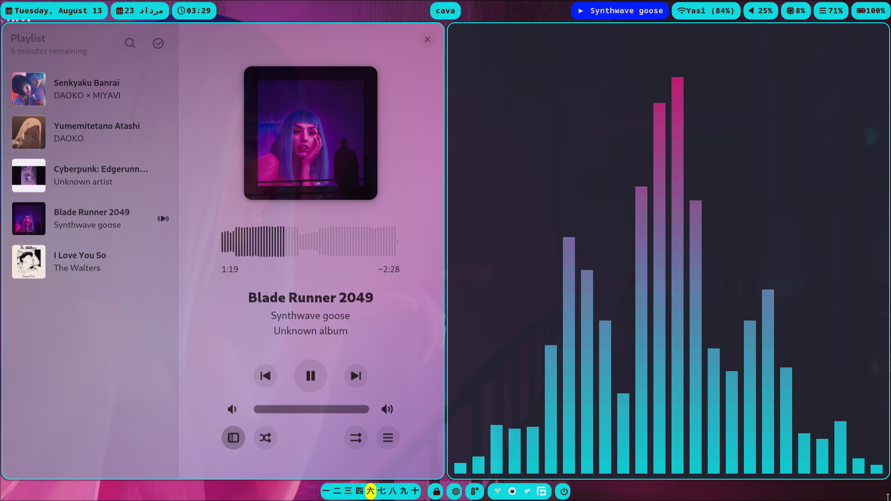
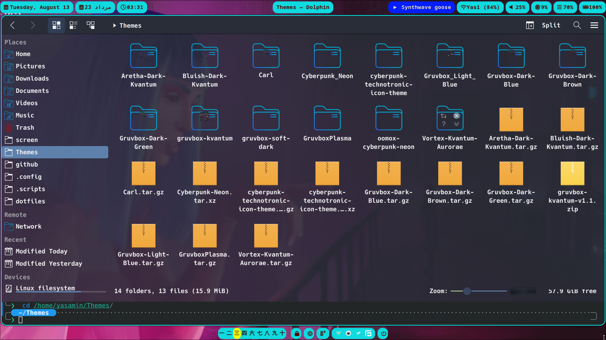
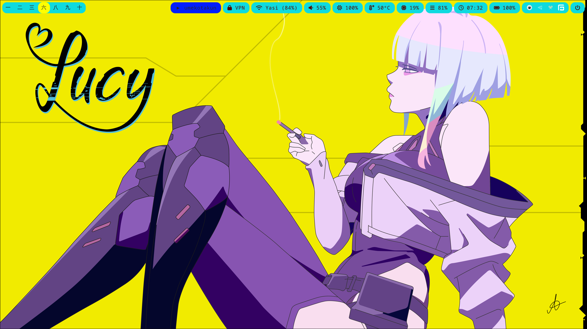
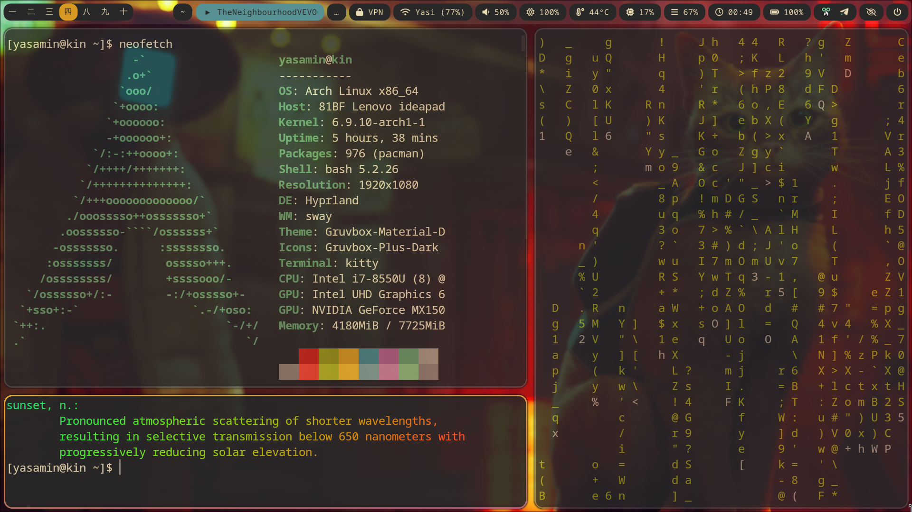
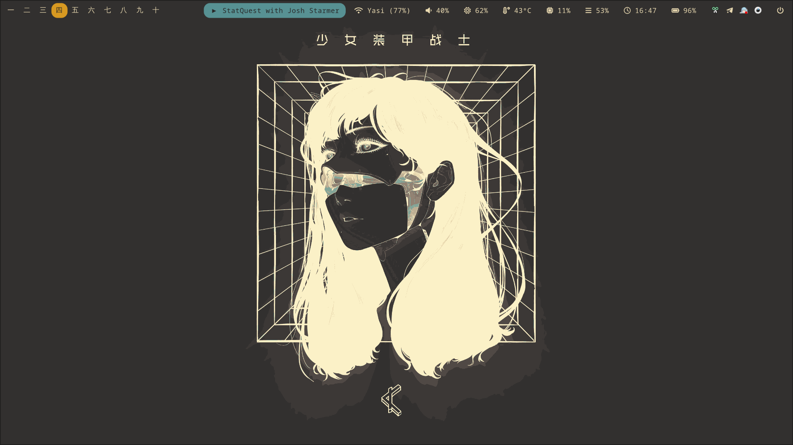

  

> 01:01:01; Now if that's not a perfect screenshot I don't know what is :D

#### [in construction 🛠️.]

## 🌌 Overview
This repo is where I keep all my rice, i.e. customized configuration for various apps + my wallpapers. I have two main themes (CyberPunk && Gruvbox), and since I wanted to keep both, I have saved each config with their respective theme name. Maybe I should've branched out but I didn't lol.

This is mostly a place for me to docment what I learn and I have no idea where it will go. However, I hope it can be helpful to others too and give you ideas to where you wanna go with it. I have also credited the codes that I have used at the end of this page.

Anyways, thanks for looking up my repo ;)

## 📸 CyberPunk Showcase

| **Everything, Everywhere, All At Once!**                 | 
| -------------------------------------------------------- |
|         |

| **Fuzzel**                 | 
| -------------------------------------------------------- |
|         |

| **Fastfetch + Peaclock + Htop + Kitty + Fish (+ tide)**                 | 
| -------------------------------------------------------- |
|         |

| **Amberol + Cava**                 | 
| -------------------------------------------------------- |
|         |

| **Dolphin + KDE themes and icons**                | 
| -------------------------------------------------------- |
|         |

| **Hyprlock**                 | 
| -------------------------------------------------------- |
|         |

  **Wallpaper :D**                                              | 
| -------------------------------------------------------- |
|         |

## 📸 Gruvbox Showcase
|  **Fuzzel**                                              | 
| -------------------------------------------------------- |
|         |

| **Neofetch**                                             |
| -------------------------------------------------------- |
|                                 |

| **Dolphin**                                              |
| -------------------------------------------------------- |
|                                 |

| **Wallpaper**                                            |
| -------------------------------------------------------- |
|                                 |

## ⚙️ Programs
| Component         | Program    |
|-------------------|------------|
| Operating System 🖥️ | [Arch Linux](https://archlinux.org)  |
| Windows Manager 🪟| [hyprland](https://github.com/hyprwm/Hyprland)  |
| Terminal 📳       | [kitty](https://github.com/kovidgoyal/kitty)        |
| Shell 🐚          | [fish](https://github.com/fish-shell/fish-shell) / [theme](https://github.com/IlanCosman/tide) |
| GUI File Manager 🗃️ | [Dolphin](https://github.com/KDE/dolphin)  |
| Wallpaper Setter 🖌️ |  [hyprpaper](https://github.com/hyprwm/hyprpaper) / [swww](https://github.com/LGFae/swww) / [waypaper GUI](https://github.com/anufrievroman/waypaper)   |
| Fetch 🖼️          | [fastfetch](https://github.com/fastfetch-cli/fastfetch) |
| Bar 📊            | [waybar](https://github.com/Alexays/Waybar)      |
| Launcher 🚀       | [fuzzel](https://codeberg.org/dnkl/fuzzel)          |
| Lockscreen 🔒     | [hyprlock](https://github.com/hyprwm/hyprlock)  |
| Music Player 🎵   | [amberol](https://gitlab.gnome.org/World/amberol)      |
| Visualiser 📊     | [cava](https://github.com/karlstav/cava)          |
| Others 🌱         | [peaclock](https://github.com/octobanana/peaclock) |

## 💻 TODO

### General 
- [ ] for the love of God, automate the backup process.

### Waybar
- [ ] fix keyboard layout module (hyprland/language)
- [ ] make cpu icon red after specific threshold
- [ ] brightness control with mouse scrolling (backlight module)
- [ ] open bluetooth management GUI on click (bluetooth module)
- [x] wifi disconnect icon needed (network module)
- [x] Persian date module! (custom)
- [ ] microphone check (on click opens GUI) (for pipewire)
- [ ] change keyboard language on click
- [x] add bottom or left waybar for taskbar apps!
- [ ] add custom modules like weather, mail, ...
- [ ] scratchpads not working?
- [ ] increase bar2 height! (seems easy, it's not)

### Hyprland

- [ ] add minimizing keybinds?
- [ ] open hiddify appimage in workspace 10, on startup (possible?)

### To be added

- [ ] swaync / dunst
- [ ] hypridle
- [ ] sddm
- [ ] vim / neovim
- [ ] zathura
- [ ] ranger
- [ ] emacs

## 📝 Credits

I have borrowed code from these repos and changed some or most of them to my liking:

- **Spelljinxer** - readme doc! : [dotfiles](https://github.com/Spelljinxer/dotfiles).
- **Morhetz** - waybar config: [gruvbox](https://github.com/morhetz/gruvbox).
- **Catppuccin** - hyprlcok config: [hyprlock](https://github.com/catppuccin/hyprlock)
- **Dracula** - fuzzel config: [Darcula](https://draculatheme.com/fuzzel)
- **ALEX5402** - fastfetch config:[dotfiles](https://github.com/ALEX5402/dotfiles)
