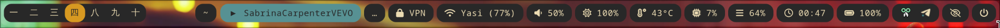
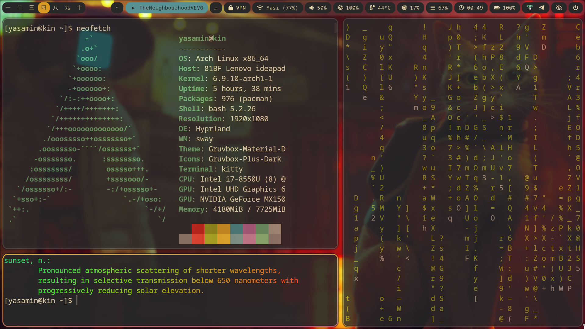
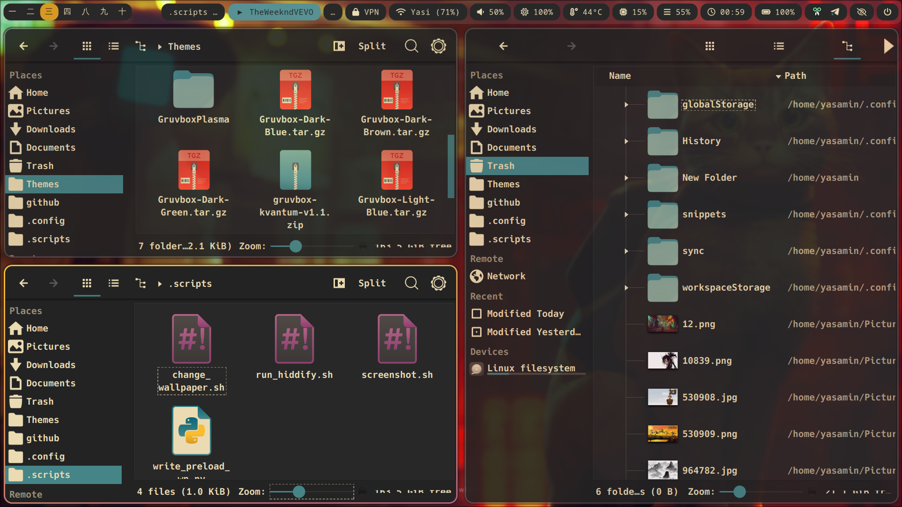
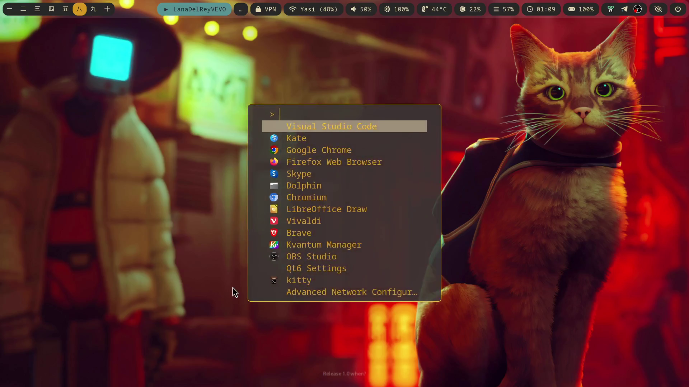

# dotfiles

#### [This repo is in construction 🛠️.]

My Gruvbox themed rice:

Waybar:

  
🌻 Gruvbox Theme

  Waybar:
  
  Kitty:
  
  Dolphin:
  
  Fuzzel:
  

Currently, there are configs for:

* fuzzel
* hyprland
* hyprpaper
* kitty
* waybar 

## TODO

### Waybar
- [ ] fix keyboard layout module (hyprland/language)
- [ ] make cpu icon red after specific threshold
- [ ] brightness control with mouse scrolling (backlight module)
- [ ] open bluetooth management GUI on click (bluetooth module)
- [x] wifi disconnect icon needed (network module)
- [x] Persian date module! (custom)
- [ ] microphone check (on click opens GUI) (for pipewire)
- [ ] change keyboard language on click
- [x] add bottom or left waybar for taskbar apps!
- [ ] add custom modules like weather, mail, ...
- [ ] scratchpads not working?

### Hyprland

- [ ] add minimizing keybinds?
- [ ] open hiddify appimage in workspace 10, on startup (possible?)
